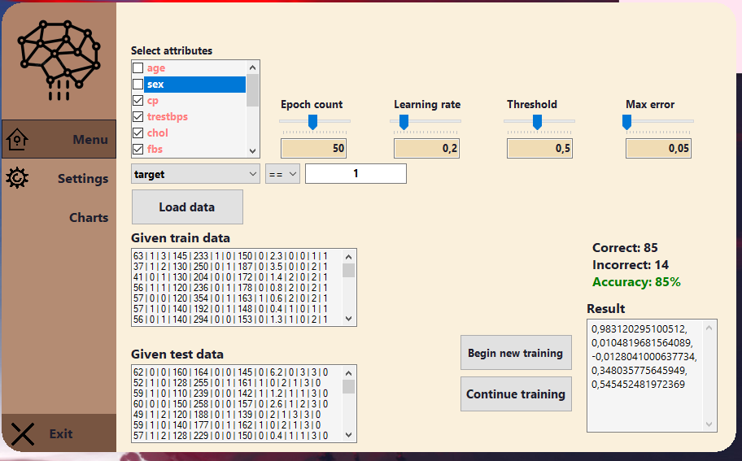

# NAI
### MP_2

Celem jest napisanie programu, który pobiera następujące argumenty:

train-set: nazwa pliku zawierającego zbiór treningowy w postaci csv lub txt 

test-set: nazwa pliku zawierającego zbiór testowy w postaci csv lub txt 

Program uczy się na danych z train-set, a następnie dokonuje klasyfikacji pliku test-set. Jeśli błąd klasyfikacji przekracza parametr t (procent dopuszczalnego błędu) to program powtarza trening do momentu uzyskania błędu nieprzekraczającego t.  

Jako dane można wziąć: 

dane 2-wymiarowe sztucznie wygenerowane, np. pary liczb, x, y takie, że x+y=-1 (np.) 

dane iris – setosa vs. pozostałe kwiaty 

Program ma też dostarczać testowy interfejs (niekoniecznie graficzny), który umożliwia ręczne testowanie perceptronu. Czyli podamy mu dane testowe ręcznie i sprawdzimy wynik na wyjściu. 

<b>UWAGI:</b> 

Liczba wymiarów wektorów powinna być zmienna, wczytywana z danych, a nie wpisana na sztywno w kodzie.  

Przykładowe klasy: Perceptron (pola: weights[], threshold, dimension, learninRate; metody: compute, learn), Trainer (pola np.: dane, trainTestRatio, dimension, learninRate, etc.), UI 
Po każdej modyfikacji wag warto normalizować wektor.

Nie można korzystać z gotowych bibliotek typu wektor, perceptron itp. Można korzystać z gotowych kolekcji (Array listy itp.,), klasy Math i klas do wczytywania danych

Result:
Auto-mapping input txt/csv files, flexible choice of considered attributes and settings 
=============
### MP3

Celem jest napisanie programu, który pobiera następujące argumenty:
•	train-set: nazwa pliku zawierającego zbiór treningowy w postaci txt
•	test-set: nazwa pliku zawierającego zbiór testowy w postaci txt
Program uczy się na danych z train-set, a następnie dokonuje klasyfikacji pliku test-set. 
Dane to klasyfikacja języka naturalnego dokumentu tekstowego za pomocą rozkładu liter ASCII (ile procentowo jest każdej z liter: a -..%, b- ..% etc.)

Klasyfikacja języka:
1.	wybieramy grupę 3 języków: skandynawskie (duński, norweski, szwedzki) albo romańskie (hiszpański, portugalski, włoski)
2.	ściągamy z Wikipedii teksty paralelne (czyli hasła sobie odpowiadające) – po 30-50 słów każdy teks, i tak z 9 tekstów z każdego języka, i dzielimy 2/3 train, 1/3 test, po równej ilości tekstów z każdego języka.
3.	czyścimy dane usuwając interpunkcję i znaki diakrytyczne (np. å, ü etc.).
4.	ustawiamy wektor 26 wymiarowy (liczba liter alfabetu) i 1 warstwę klasyfikatora
5.	Dodajemy interfejs graficzny – okienko do wpisania tekstu testowego, które po wpisaniu tekstu poda nam rozpoznany język

Result:
Сombining the UI part in c# and back-end-logic in python, using softmax and sigmoid activation function
=============
